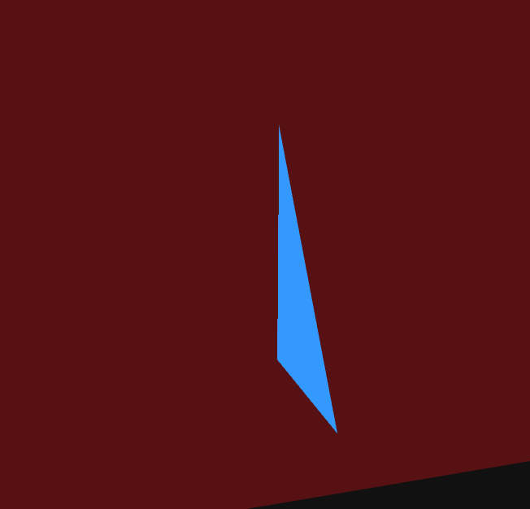
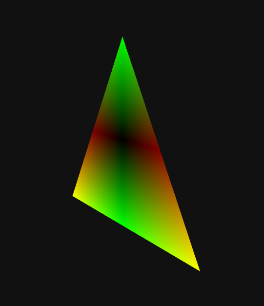

# Rasterización de Triángulos en GPU

---

## Participantes

Alejandro Ortiz Cortes  
Diego Alberto Romero Olmos  
Melissa Forero  
Gabriel Anzola

---

# Descripción del tema

La rasterización de triángulos es el proceso mediante el cual la GPU convierte geometría 3D en píxeles visibles en la pantalla.

En el pipeline gráfico moderno, los triángulos son la unidad fundamental de renderizado. Todo modelo 3D está compuesto por triángulos.

El proceso general incluye:

1. Transformación de vértices (Vertex Shader)
2. Clipping (recorte contra el frustum o planos definidos)
3. Back-face culling (eliminación de caras traseras)
4. Rasterización
5. Generación de fragmentos
6. Fragment Shader (cálculo del color final)

Este proyecto demuestra visualmente estos pasos utilizando React Three Fiber (Three.js en React).

---

# Explicación matemática resumida

## 1. Representación del triángulo

Un triángulo está definido por tres vértices:

V1(x1, y1, z1)  
V2(x2, y2, z2)  
V3(x3, y3, z3)

---

## 2. Back-Face Culling

Se calcula la normal del triángulo usando el producto cruz:

N = (V2 - V1) × (V3 - V1)

Luego se calcula el producto punto con la dirección de la cámara:

N · Vview

Si el resultado es negativo → la cara está orientada hacia atrás → se descarta antes de la rasterización.

---

## 3. Clipping

Un plano se define matemáticamente como:

Ax + By + Cz + D = 0

En el proyecto se utilizó:

Plane(1, 0, 0, -0.3)

Esto significa que todos los fragmentos que no cumplen la condición del plano son descartados por la GPU.

---

## 4. Rasterización

La GPU convierte el área del triángulo en fragmentos (posibles píxeles), interpolando valores como posición y color.

---

# Descripción de la implementación

El proyecto fue desarrollado con:

- React
- React Three Fiber
- Three.js
- Leva (panel de controles)

Se implementó:

- Geometría manual usando BufferGeometry
- Shader personalizado con ShaderMaterial
- Activación de clipping en el renderer
- Back-face culling configurable
- Modo wireframe
- Visualización de fragmentos
- Plano visual para representar el clipping

---

# Código relevante

## Creación del triángulo

```javascript
const vertices = new Float32Array([
  -1, -1, 0,
   1, -1, 0,
   0,  1, 0
])

geo.setAttribute("position", new THREE.BufferAttribute(vertices, 3))
```

---

## Plano de Clipping

```javascript
const clippingPlane = new THREE.Plane(
  new THREE.Vector3(1, 0, 0),
  -0.3
)
```

---

## Back-Face Culling

```javascript
side: backFaceCulling ? THREE.FrontSide : THREE.DoubleSide
```

---

## Fragment Shader (coloreado por posición)

```glsl
if(showFragments){
  gl_FragColor = vec4(abs(vPosition), 1.0);
} else {
  gl_FragColor = vec4(0.2, 0.6, 1.0, 1.0);
}
```

---

# Resultados visuales

Vista de clipping:



Vista de fragmentos:



---

# Prompts utilizados (uso de IA)

Se utilizó IA como apoyo técnico para:

- Explicar el funcionamiento matemático del clipping
- Generar ejemplos de ShaderMaterial en Three.js
- Resolver errores relacionados con Vite
- Comprender la diferencia entre wireframe y back-face culling

Ejemplo de prompt utilizado:

"Explica por qué wireframe no funciona con backFaceCulling en Three.js"

---

# Aprendizajes

- Comprendimos cómo la GPU convierte triángulos en fragmentos.
- Entendimos la diferencia entre rasterización y generación de fragmentos.
- Aprendimos cómo funciona matemáticamente el back-face culling.
- Comprendimos que el clipping se basa en ecuaciones de plano.
- Entendimos que wireframe dibuja líneas y no caras completas.

---

# Dificultades encontradas

- Confusión entre wireframe y back-face culling.
- Entender la diferencia entre plano matemático y plano visual.

---

# Conclusión

Este proyecto permitió visualizar de manera práctica cómo funciona el proceso de rasterización en la GPU.

La implementación con shaders personalizados permitió comprender mejor el pipeline gráfico moderno y la importancia del triángulo como primitiva fundamental.
